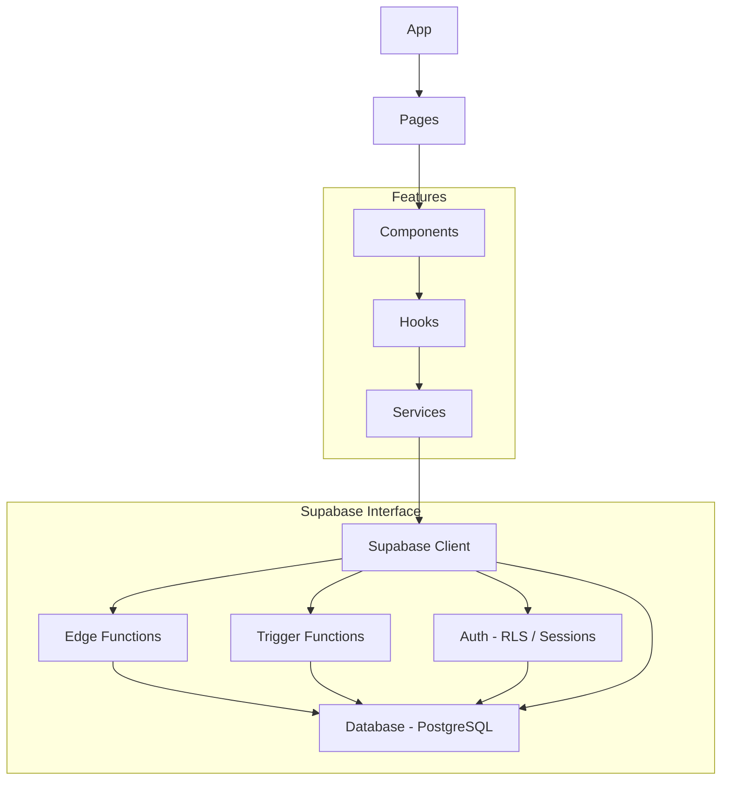
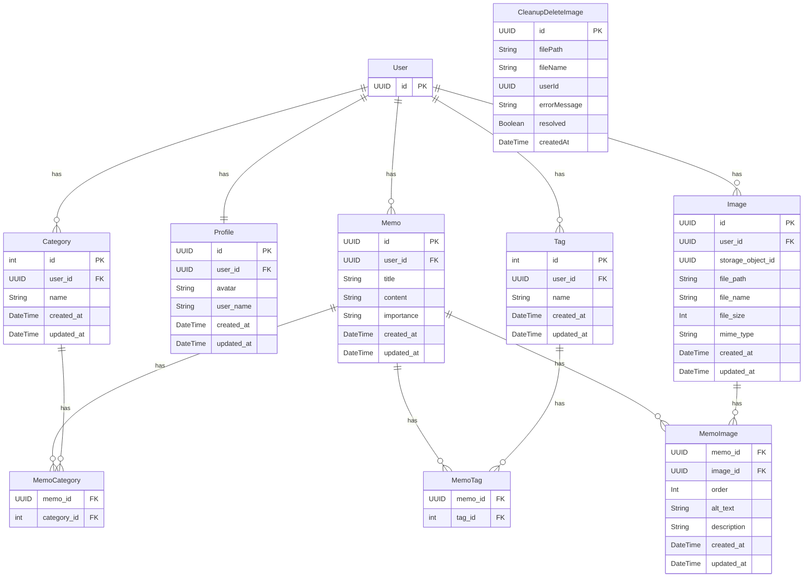

## 概要

拡張性と保守性を重視して設計されたReactベースのSPAメモアプリケーション 

## 目的
- 拡張的で効率的な運用保守ができるアーキテクチャと責務分離のレイヤード設計を目指す
- shadcn/uiのUIを使用してパーツ別カスタムUIコンポーネントを作成して再利用可能にする
- supabase, tanstack-query, tRPCの各クライアントを使用してカスタムフックを作成して再利用可能にする
- supabaseをバックエンドとして使用する（auth・database postgres・edge functions）
- prismaをデータベース管理として使用する（DBスキーマ・マイグレーション）
- edgeのORMにprisma・drizzleを使用する（トランザクション・リレーション）

## 開発環境  
- react 18.2.0
- react-router-dom 7.2.0
- react-hook-form 7.54.2
- react-query 5.68.0
- vite 6.1.1
- vitest 3.0.6
- trpc 11.0.0
- typescript 5.7.0
- zod 3.24.2
- zustand 5.0.3
- shadcn/ui
- tailwindcss 3.4.13
- react-helmet-async 2.0.5
- prisma 6.5.0
- drizzle-orm 0.32.2
- supabase 2.19.7
- deno 2.2.5
- hono 4.0.0
- node 20.18.1

## ディレクトリ構造 
```text
/
├── public
├── src
│    ├── components ...共通コンポーネントディレクトリ
│    │    ├── form ...フォームパーツコンポーネント
│    │    ├── layout ...レイアウトコンポーネント
│    │    ├── ui ...shadcn/uiコンポーネント
│    │    ├── mode-toggle.tsx ...テーマ切替
│    │    └── responsive-dialog.tsx ...ドロワー/ダイアログ
│    ├── features ...機能別ディレクトリ
│    │    ├── auth
│    │    ├── account
│    │    ├── memo
│    │    ├── profile
│    │    │     ├── components ...機能別コンポーネント
│    │    │     ├── hooks ...機能別フックス
│    │    │     ├── schemas ...機能別スキーマ
│    │    │     ├── services ...機能別サービス
│    │    │     └── types ...機能別型
│    │    └── settings
│    ├── lib
│    │    ├── auth.ts ...認証カスタム関数
│    │    ├── fetchClient.ts ...Fetch API クライアント
│    │    ├── supabase.ts ...supabaseクライアント
│    │    ├── queryClient.ts ...tanstackクライアント
│    │    ├── trpc.ts ...trpcクライアント
│    │    ├── util.ts ...ユーティリティ関数
│    │    ├── constants.ts ...定数設定
│    │    └── errors.ts ...カスタムエラー定義
│    ├── errors ...共通エラーハンドリング設定
│    ├── hooks ...共通フックスディレクトリ
│    │    ├── use-theme-provider ...テーマ切替状態管理
│    │    ├── use-session-observer ...ユーザー認証状態
│    │    ├── use-session-store ...ユーザー認証状態管理
│    │    ├── use-tanstack-query ...tanstack query共通フック
│    │    ├── use-toast ...toastUI状態管理
│    │    └── use-media-query ...メディアクエリ判別
│    ├── services ...共通サービス
│    ├── pages ...ページルーティング設定
│    ├── routes ...react-routerルーティング設定
│    ├── schemas ...共通スキーマ
│    ├── types ...共通型
│    └── App.tsx
├── prisma ...prismaスキーマ・マイグレーション
├── supabase/functions ...エッジファンクション
│    ├── _shared ...cors設定など
│    ├── delete-user-account ...アカウント削除
│    ├── sava-memo ...中間テーブルへの保存
│    └── trpc ...tRPC
├── tests ...テスト
│    ├── components
│    ├── features
│    ├── hooks
│    └── pages
├── index.html
├── tailwind.config.js
├── package.json
├── tsconfig.json
└── vite.config.js

```
## レイヤー構造
```text
App (App.tsx)
└── pages
    └─ components
         └─ features
             └─ hooks
                └─ services
                    └─ Supabase interface
                        ├── Edge Functions     
                        ├── Trigger Functions  
                        ├── Auth               
                        └── Database(postgres)           
```



## ER図



## メモ機能
- メモにはタイトル、カテゴリー、コンテンツ、重要度、タグを入力できます
- メモを追加するとメモの一覧が表示されます
- 一覧表示からメモごとの編集と削除ができます

## API切替
- 複数のapiデータ通信の切替を行えます

- supabaseClientクエリ + trigger functions 
- supabaseClientクエリ + tanstack Query + edge functions prisma/ drizzle
- supabaseClientクエリ + tRPC + edge functions prisma

## フォームパーツコンポーネントの使い方
shadcn/uiのFormコンポーネント内で使用できる  
パーツコンポーネントを読み込みlabel, placeholder, name, optionsを渡す
```typescript
import { Form } from "@/components/ui/form";
import FormInput from "@/components/form/form-input";

...

<FormWrapper onSubmit={handleSubmit} form={form}>
    <FormInput label="タイトル" placeholder="タイトルを入力してください" name="title" />
    
    ...

```

## ドロワー/ダイアログコンポーネントの使い方
- メディアクエリによるドロワーとダイアログの切替が行えます

```typescript
import ResponsiveDialog from "@/components/responsive-dialog"
import useMediaQuery  from "@/hooks/use-media-query"

...

<ResponsiveDialog open={open} onOpenChange={setOpen} isDesktop={isDesktop}  buttonTitle="メモ追加" dialogTitle="Memo" dialogDescription="メモを残そう" className="flex justify-center">
  <MemoForm onSubmit={handleFormSubmit} />
</ResponsiveDialog>

...

```

## テーマトグルコンポーネントの使い方
- システム / ライト / ダークのテーマ切替が行えます

```typescript
import { ModeToggle } from "@/components/mode-toggle";

...

<ModeToggle />

...

```

## トーストコンポーネントの使い方
ui/toasterからToastコンポーネントを取得し、上階層に配置します。  
useToastからtoastを取得し、コンテンツを渡すとトーストが表示されます。  

```typescript
toast({title: "トーストが表示されました"})
```
Appはクライアント・プロバイダー、ルートはrouterに分離してあり、ToastはUIという事でlayoutに配置しています。  
apiの状態は全てトースト表示をしています。

## エラーハンドリング
- apiエラーはerrors/error-handlerで管理しています。
- TRPCはエラーフォーマッターで整形してから返しています。
- TRPCのZodエラーに関してはUI側で取得しRHFのformState.errorsに渡して表示しています。

## Fetch API クライアント
APIとの通信を行うためのカスタムクライアントです。

### 基本的な使い方
lib/fetchClient.ts に実装されています。

### インスタンスの作成:
```typescript
import { FetchClient } from "@/lib/fetchClient";

const httpClient = new FetchClient({
  baseUrl: "[https://your-api-endpoint.com](https://your-api-endpoint.com)", // ベースURL
  timeout: 5000, // タイムアウト (ミリ秒)
  maxRetry: 3, // 最大リトライ回数
  // その他のオプション (retryDelay, baseBackoff, retryStatus, retryMethods)
});
```

### リクエストの送信:
```typescript
try {
  const data = await httpClient.get("/api/memos"); // GETリクエスト
  console.log(data);

  const newMemo = { title: "新しいメモ", content: "メモの内容" };
  const createdMemo = await httpClient.post("/api/memos", { body: JSON.stringify(newMemo) }); // POSTリクエスト
  console.log(createdMemo);

  // PUTリクエスト、DELETEリクエストも同様
  // const updatedMemo = await httpClient.put("/api/memos/1", { body: JSON.stringify({ content: "更新された内容" }) });
  // await httpClient.delete("/api/memos/1");
} catch (error) {
  console.error("APIエラー:", error);
}
```

### 特徴
- ベースURL設定: インスタンス作成時にAPIのベースURLを設定できます。
- タイムアウト: リクエストのタイムアウト時間を設定できます。
- リトライ: 500系のサーバーエラーとネットワークエラー発生時に、設定された回数まで自動的にリトライを行います。リトライ対象のステータスコードとHTTPメソッドはオプションで設定可能です。
- デフォルトヘッダー: Content-Type: application/json がデフォルトで設定されています。
- エラーハンドリング: タイムアウト、ネットワークエラー、HTTPエラー、JSONパースエラーなどのカスタムエラークラス (lib/errors.ts に定義) を使用して、より具体的なエラー情報を取得できます。

## tanstack queryカスタムフック
### 基本的な使い方
hooks/use-tanstack-query.ts に実装されています。

```typescript
const { isLoading, data } = useApiQuery({
      queryKey: ['key'],
      queryFn:  () => getApiData(),
      enabled: false,
   },{
      onSuccess: () => console.log("success!"),
      onError: () => console.log("error!"),
      onSettled: () => console.log("finish!"),
   })

const { isPending, data } = useApiMutation({
      mutationFn:  () => getApiData(),
      enabled: false,
      onSuccess: () => console.log("success!"),
      onError: () => console.log("error!"),
      onSettled: () => console.log("finish!"),
   })
```

## まとめ
- shadcn/uiのFormコンポーネントはzodとreact-hook-formと連携しているのでインストールする必要がある
- shadcn/uiのメディアクエリ別ドロワー/ダイアログはwindow幅を取得する関数が必要、今回はコードを記述しているが、他のライブラリでも可能
- shadcn/uiのテーマ切替はドロップダウンなので三段階トグルに変更しアイコンで切替可能にしておく
- FormのUIを構成するコンポーネントが多く、コードが長くなるのでパーツごとにコンポーネントにしておく
- データをAPIで呼び出す事を想定しzodのスキーマをschemasに、スキーマの型をtypesに分けておく
- ダイアログ/ドロワーはよく使用するので再利用可能な共有コンポーネントにしておく
- Fetchは多くの場面で使用するので再利用可能なクラスにしておく
- supabaseとprismaは型を出力してくれるので効率的な開発ができるようにしておく
- apiでのCRUDはservicesで再利用可能なフックにしておく
- prismaのバグでuuid_generate_v4と@updateAtのスキーマが使えないので、gen_random_uuid()とdefault(now())とplpgトリガーで対応する必要がある
- サーバーエラーはhook内でtoastで表示処理とするとUI側で行わなくて良い
- supabaseClient/tanstack QueryとtRPC/tanstack Queryを個別に使用しているが、コード量としてはそこまで変わらない
- denoとhonoの良さはedgeの様なリソースが限られたところで使えるということを感じる
- tRPCはv9, v10, v11で書き方から使えるメソッドやプロパティも異なる
- tRPCでのtanstack Queryも同様に統合前後で異なる、共通化処理の型が複雑
- tRPCをsupabaseで使用するとエラーの型がことなるので合わせる必要がある
- tRPCのエラーはTRPCErrorよりTRPCClientErrorにフォーマットで出力した方が扱いやすい
- zodErrorをtrpcで他言語化する場合サーバーとクライアントの両方にmapperを置く必要がある
- tanstack queryのuseQueryはv5でoptionsのコールバックが幾つか削除されており、自分で実装する必要がある
- edge functionsの認証はtokenヘッダーをfunctions内でも使用する必要がある
- supabaseからのコールバックはPKCEで自動処理されるのでパスクエリ判別はできないのでidentitiesなどから判別する必要がある
- webhookからのコールバックでAppが再マウントするのでcallback用ページで受けてから遷移する必要がある
- supabase storageは初期値でCDNでキャッシュされるため適宜ハッシュを付けておく
- Fileをedge側に送信するとFileではなくなるのでbase64に変換して送信しedge側で戻す
- react18ではtesting-library/react-hooksではなくtesting-library/reactを使用する
- viteでrequireが使用できないということはvitestでも使用できない
- shadcn/uiのフォームなどのDOM構造はボタン制御が多く、内部非同期も多いのでawait, waitFor, actの警告がでやすい
- vitestでは複数の関数をモックする事はできないのでファイルを分割するか処理を分けるかなど対処が必要
- 例えばある関数が成功したら別の関数が起動して処理を行うなどのモックのexpectは一つになる
- supabase edgeでのprisma clientはdeno用のedgeを使用する必要がある
- supabase edgeでprismaするにはdeno用adapterがないのでaccelerate経由でクエリを送信する必要がある
- accelerateを使用しない場合、pgpl関数をRPCで呼ぶ、設計変える、drizzleに変えるなどがある
- prismaでカラムを配列型にするとnot nullにならないので後でSQLで行う必要がある
- supabase rpcで呼び出せるのはfunctionでprocedureではない
- plpgのfunction内でトランザクションコマンドは使用できない。function内でprocedureを呼んでも使用不可。
- plpg内のfunction内では例外発生で自動的にロールバックする。raise exceptionでEXCEPTIONブロックでもロールバックできる。
- plpg内のprocedure内でトランザクションコマンドは使用できるが、制限が多く基本的には使用不可。自動ロールバックで行う必要がある。
- trpcクライアントでedge側のAppRouter型を使用しているのでviteでbuild時にdenoのエラーがでる。対応策としてbuild前にtrpcの型だけ共通ディレクトリに生成してtrpcクライアントのAppRouterとして使用すればbuild自体はできる。多少の型エラーがでる場合は修正するかts-ignoreする
