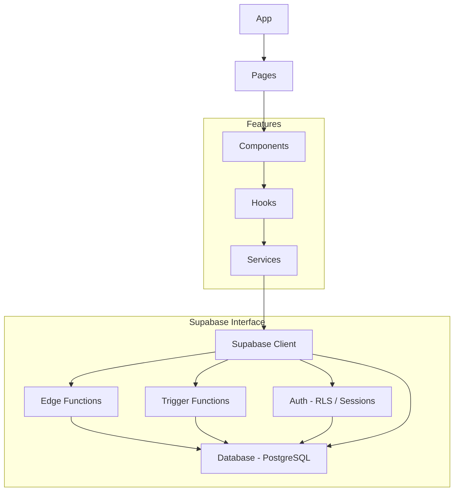
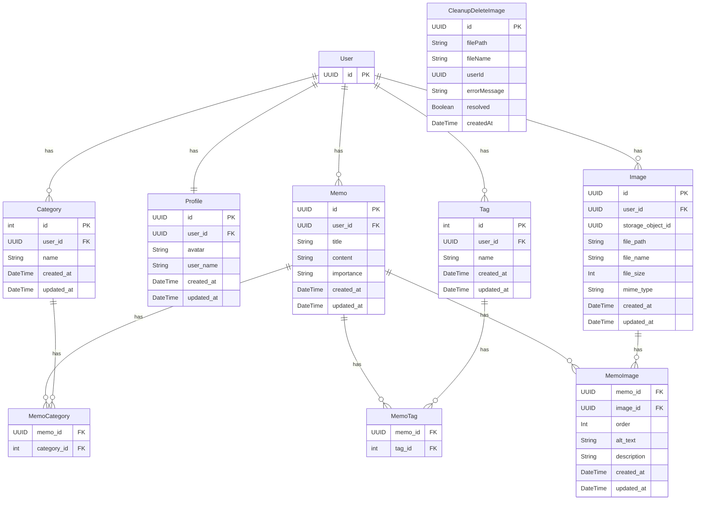
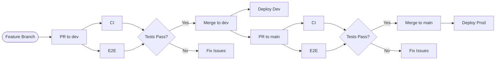

## 概要

拡張性と保守性を重視して設計されたReactベースのSPAメモアプリケーション 

## 目的
- 拡張的で効率的な運用保守ができるアーキテクチャと責務分離のレイヤード設計を目指す
- shadcn/uiのUIを使用してパーツ別カスタムUIコンポーネントを作成して再利用可能にする
- supabase, tanstack-query, tRPCの各クライアントを使用してカスタムフックを作成して再利用可能にする
- supabaseをバックエンドとして使用する（auth・database postgres・edge functions）
- prismaをデータベース管理として使用する（DBスキーマ・マイグレーション）
- edgeのORMにprisma・drizzleを使用する（トランザクション・リレーション）
- 複数api通信とedge環境でのORMによるパフォーマンス比較検証、部分的な分離によるアーキテクチャ設計の検証

## 開発環境  
- react 18.2.0
- react-router-dom 7.2.0
- react-hook-form 7.54.2
- react-query 5.68.0
- vite 6.1.1
- vitest 3.0.6
- playwright 1.53.0
- msw 2.10.2
- playwright-msw 3.0.1
- trpc 11.0.0
- typescript 5.7.0
- zod 3.24.2
- zustand 5.0.3
- shadcn/ui
- tailwindcss 3.4.13
- react-helmet-async 2.0.5
- prisma 6.5.0
- drizzle-orm 0.32.2
- supabase 2.19.7
- deno 2.2.5
- hono 4.0.0
- node 20.18.1

## ディレクトリ構造 
```text
/
├── public
├── src
│    ├── components ...共通コンポーネントディレクトリ
│    │    ├── form ...フォームパーツコンポーネント
│    │    ├── layout ...レイアウトコンポーネント
│    │    ├── ui ...shadcn/uiコンポーネント
│    │    ├── mode-toggle.tsx ...テーマ切替
│    │    ├── file-thumbnail.tsx ...選択ファイルサムネイル表示
│    │    ├── file-uploader.tsx ...ファイル選択
│    │    ├── variant-toggle.tsx ...api通信切替
│    │    ├── with-behavior-variant.tsx ...コンポーネント切替
│    │    └── responsive-dialog.tsx ...ドロワー/ダイアログ
│    ├── features ...機能別ディレクトリ
│    │    ├── auth
│    │    ├── account
│    │    ├── memo
│    │    ├── profile
│    │    │     ├── components ...機能別コンポーネント
│    │    │     ├── hooks ...機能別フックス
│    │    │     ├── schemas ...機能別スキーマ
│    │    │     ├── services ...機能別サービス
│    │    │     └── types ...機能別型
│    │    └── settings
│    ├── lib
│    │    ├── auth.ts ...認証カスタム関数
│    │    ├── fetchClient.ts ...Fetch API クライアント
│    │    ├── supabase.ts ...supabaseクライアント
│    │    ├── queryClient.ts ...tanstackクライアント
│    │    ├── trpc.ts ...trpcクライアント
│    │    ├── util.ts ...ユーティリティ関数
│    │    ├── constants.ts ...定数設定
│    │    └── errors.ts ...カスタムエラー定義
│    ├── errors ...共通エラーハンドリング設定
│    ├── hooks ...共通フックスディレクトリ
│    │    ├── use-theme-provider ...テーマ切替状態管理
│    │    ├── use-session-observer ...ユーザー認証状態
│    │    ├── use-session-store ...ユーザー認証状態管理
│    │    ├── use-tanstack-query ...tanstack query共通フック
│    │    ├── use-behavior-variant ...コンポーネント状態管理
│    │    ├── use-image-upload-tanstack 
│    │    ├── use-image-upload-trpc 
│    │    ├── use-local-file-manager ...選択ファイル状態管理
│    │    ├── use-toast ...toastUI状態管理
│    │    └── use-media-query ...メディアクエリ判別
│    ├── services ...共通サービス
│    ├── pages ...ページルーティング設定
│    ├── routes ...react-routerルーティング設定
│    ├── schemas ...共通スキーマ
│    ├── types ...共通型
│    └── App.tsx
├── prisma ...prismaスキーマ・マイグレーション
├── supabase/functions ...エッジファンクション
│    ├── _shared ...cors設定など
│    ├── cleanup-image-delete ...storageの定期削除
│    ├── delete-user-account ...アカウント削除
│    ├── sava-memo ...中間テーブルへの保存
│    └── trpc ...tRPC
├── tests ...ユニット/統合テスト
│    ├── components
│    ├── features
│    ├── hooks
│    └── pages
├── e2e ...e2eテスト/VRT
├── index.html
├── tailwind.config.js
├── package.json
├── tsconfig.json
└── vite.config.js

```
## レイヤー構造
```text
App (App.tsx)
└── pages
    └─ components
         └─ features
             └─ hooks
                └─ services
                    └─ Supabase interface
                        ├── Edge Functions     
                        ├── Trigger Functions  
                        ├── Auth               
                        └── Database(postgres)           
```



## ER図


## メモ機能
- メモにはタイトル、カテゴリー、コンテンツ、重要度、タグを入力できます
- メモを追加するとメモの一覧が表示されます
- 一覧表示からメモごとの編集と削除ができます

## ファイルアップロード機能
- ファイルアップロード・削除ができます
- アップロード時の複数選択、サムネイル表示ができます
- ファイルごとにコメントがつけられます
- メモに追加・削除ができます

## API切替
- 複数のapiデータ通信の切替を行えます

- supabaseClientクエリ + trigger functions 
- supabaseClientクエリ + tanstack Query + edge functions prisma/ drizzle
- supabaseClientクエリ + tRPC + edge functions prisma

- 切替はcomponents/variant-toggle, with-behavior-variant, hooks/use-behavior-variantを使用して行っています。
- useBehaviorVariantにzustandストア作成、withBehaviorVariantで値を取得しコンポーネントを返す。
- VariantToggleでuseBehaiorVariantのapiのidを切替、ページコンポーネント内でwithBehaviorVariantからコンポーネントを受け取るという流れです。
- VariantToggleをグローバルヘッダーなどに、withBehaviorVariantを切り替えたいコンポーネントがあるページコンポーネントなどに配置します。
- zustandのpersistでローカルストレージに保存し永続化しています。
- fetures以下の各managerコンポーネントを切替るだけで、manager以下のコンポーネントは機能内で共通化しています。

## フォームパーツコンポーネントの使い方
shadcn/uiのFormコンポーネント内で使用できる  
パーツコンポーネントを読み込みlabel, placeholder, name, optionsを渡す
```typescript
import { Form } from "@/components/ui/form";
import FormInput from "@/components/form/form-input";

...

<FormWrapper onSubmit={handleSubmit} form={form}>
    <FormInput label="タイトル" placeholder="タイトルを入力してください" name="title" />
    
    ...

```

## ドロワー/ダイアログコンポーネントの使い方
- メディアクエリによるドロワーとダイアログの切替が行えます
- hooks/useMediaQueryでwindowサイズを取得して、切り替えたい値を設定しています

```typescript
import ResponsiveDialog from "@/components/responsive-dialog"
import useMediaQuery  from "@/hooks/use-media-query"

...

<ResponsiveDialog open={open} onOpenChange={setOpen} isDesktop={isDesktop}  buttonTitle="メモ追加" dialogTitle="Memo" dialogDescription="メモを残そう" className="flex justify-center">
  <MemoForm onSubmit={handleFormSubmit} />
</ResponsiveDialog>

...

```

## テーマトグルコンポーネントの使い方
- システム / ライト / ダークのテーマ切替が行えます
hooks/use-theme-providerでclassListからテーマclassを取得しコンテキストを作成、プロバイダーを上位に設置する  
グローバルヘッダーなどにcomponents/mode-toggleを設置して、useThemeフックを通じてテーマを渡して切り替えています  
テーマはローカルストレージに保存して永続化しています

```typescript
import { ModeToggle } from "@/components/mode-toggle";

...

<ModeToggle />

...

```

## トーストコンポーネントの使い方
ui/toasterからToastコンポーネントを取得し、上階層に配置します。  
useToastからtoastを取得し、コンテンツを渡すとトーストが表示されます。  

```typescript
toast({title: "トーストが表示されました"})
```
Appはクライアント・プロバイダー、ルートはrouterに分離してあり、ToastはUIという事でlayoutに配置しています。  
apiの状態は全てトースト表示をしています。

## ファイルアップロードコンポーネントの使い方
components/file-uploader からFileUploader、components/file-thumbnailから FileThumbnailを取得します。  
FileUploaderコンポーネントがfile選択、FileThumbnailが選択ファイルのサムネイル表示を担当しています。  
UIを分離する事でファイル選択とサムネイル表示の位置をカスタマイズする事が可能になります。  
内部でFormInputを使用しているので、FormWrapper内で使用すればrhfの機能と連携もできます。  
ファイルに対する入力はuseFieldArrayで管理をしています。  

```typescript
<FileUploader files={files} onChange={onFileChange} onError={imageError} />
<FileThumbnail files={files} onDelete={onFileDelete} onRemove={removeFileMetadata} />
```
hooks/useLocalFileManagerで選択したファイルの管理を行います。
上位コンポーネントでuseLocalFileManagerからfilesを取得し、FileUploaderやFileThumbnailに渡します。

## エラーハンドリング
- apiエラーはerrors/error-handlerで管理しています。
- TRPCはエラーフォーマッターで整形してから返しています。
- TRPCのZodエラーに関してはUI側で取得しRHFのformState.errorsに渡して表示しています。

## Fetch API クライアント
APIとの通信を行うためのカスタムクライアントです。

### 基本的な使い方
lib/fetchClient.ts に実装されています。

### インスタンスの作成:
```typescript
import { FetchClient } from "@/lib/fetchClient";

const httpClient = new FetchClient({
  baseUrl: "https://your-api-endpoint.com", // ベースURL
  timeout: 5000, // タイムアウト (ミリ秒)
  maxRetry: 3, // 最大リトライ回数
  // その他のオプション (retryDelay, baseBackoff, retryStatus, retryMethods)
});
```

### リクエストの送信:
```typescript
try {
  const data = await httpClient.get("/api/memos"); // GETリクエスト
  console.log(data);

  const newMemo = { title: "新しいメモ", content: "メモの内容" };
  const createdMemo = await httpClient.post("/api/memos", { body: JSON.stringify(newMemo) }); // POSTリクエスト
  console.log(createdMemo);

  // PUTリクエスト、DELETEリクエストも同様
  // const updatedMemo = await httpClient.put("/api/memos/1", { body: JSON.stringify({ content: "更新された内容" }) });
  // await httpClient.delete("/api/memos/1");
} catch (error) {
  console.error("APIエラー:", error);
}
```

### 特徴
- ベースURL設定: インスタンス作成時にAPIのベースURLを設定できます。
- タイムアウト: リクエストのタイムアウト時間を設定できます。
- リトライ: 500系のサーバーエラーとネットワークエラー発生時に、設定された回数まで自動的にリトライを行います。リトライ対象のステータスコードとHTTPメソッドはオプションで設定可能です。
- デフォルトヘッダー: Content-Type: application/json がデフォルトで設定されています。
- エラーハンドリング: タイムアウト、ネットワークエラー、HTTPエラー、JSONパースエラーなどのカスタムエラークラス (lib/errors.ts に定義) を使用して、より具体的なエラー情報を取得できます。

## tanstack queryカスタムフック
### 基本的な使い方
hooks/use-tanstack-query.ts に実装されています。

```typescript
const { isLoading, data } = useApiQuery({
      queryKey: ['key'],
      queryFn:  () => getApiData(),
      enabled: false,
   },{
      onSuccess: () => console.log("success!"),
      onError: () => console.log("error!"),
      onSettled: () => console.log("finish!"),
   })

const { isPending, data } = useApiMutation({
      mutationFn:  () => getApiData(),
      enabled: false,
      onSuccess: () => console.log("success!"),
      onError: () => console.log("error!"),
      onSettled: () => console.log("finish!"),
   })
```

## CI/CD ワークフロー
このプロジェクトでは、GitHub Actionsを使用したCI/CDを実行します。ViteアプリケーションとSupabaseの連携は、環境変数によって管理されています。
envの環境変数を環境ごとに設定し、デプロイ先へ設定する。DB接続先などの環境変数は、デプロイ先のサービス（Netlify, Vercel など）で設定されており、コードには含まれません。

### ローカル開発環境
- npm run devでの実行
- supabase cliでsupabase studio(Local Supabase Stack)に接続

### デプロイ環境

**dev環境**
- feature(local)->devブランチへのpush/PRをトリガーにCI/CD実行
- supabase dev用プロジェクトへ接続

**prod環境**
- dev->mainブランチへのpush/PRをトリガーにCI/CD実行
- supabase prod用プロジェクトへ接続

### 実行する事
- nodeインストール
- npm ci(install)
- npm lint
- npm build
- unit/integrationテスト vitest(components/features/hooks/lib/pages)
- deno unitテスト/lint
- prisma generate/migrate
- playwright e2eテスト(msw/VRT)

- edge function deploy
- buildアーティファクト deploy

### ワークフローの流れ


```mermaid
| トリガー | ワークフロー | 環境 | 実行内容 | 目的 |
|----------|------------|------|----------|------|
| **PR → dev** | `ci.yml` + `e2e.yml` | `development` + `test-dev` | 品質チェック + E2Eテスト | dev環境での動作保証 |
| **PR → main** | `ci.yml` + `e2e.yml` | `production` + `test-prod` | 品質チェック + E2Eテスト | 本番環境での動作保証 |
| **Push → dev** | `ci.yml` + `e2e.yml` + `deploy-dev.yml` | `development` | テスト + デプロイ | dev環境更新 |
| **Push → main** | `ci.yml` + `e2e.yml` + `deploy-prod.yml` | `production` | テスト + デプロイ | 本番環境リリース |
```

1. 開発フロー
feature/* → dev (PR) → main (PR) → デプロイ
2. 具体的な実行タイミング
**PR作成時（dev/mainへの全PR）:**

- ✅ CI Pipeline (test, lint, build)
- ✅ E2E Tests
- ✅ 品質チェック完了後にマージ可能

**マージ/Push時:**

- ✅ devブランチへのpush → Dev環境自動デプロイ
- ✅ mainブランチへのpush → Prod環境自動デプロイ

3. 実際の作業手順例
```text
bash# 1. 機能開発
git checkout -b feature/memo-enhancement
# 開発作業...
git push origin feature/memo-enhancement

# 2. dev環境へのPR
# → CI + E2E自動実行
# → テスト通過後にマージ
# → dev環境に自動デプロイ

# 3. 本番リリース準備
# dev → main PR作成
# → CI + E2E自動実行  
# → テスト通過後にマージ
# → prod環境に自動デプロイ
```

### GitHub Actions での環境ごとの環境変数設定

環境ごとに環境変数を切り替える方法はいくつかあります。

- .env.dev, .env.prod などファイルを分離する → .envは基本的にリポジトリにpushしない

- VITE_LOCAL_, VITE_DEV_, VITE_PROD_ などキー名で分岐 → キーが大量になり管理が煩雑

- GitHubのSecretsに環境ごと移す → diffが分からない

- GitHubのEnvironments機能でSecrets / Variablesを分岐 ✅

この中で最も管理がシンプルなのがEnvironments Secretsを使う方法です。

**設定手順**

1. GitHubリポジトリのSettings → Environments → New environmentで環境名を作成

2. Add environment secretsでシークレットを登録、variablesで定数を登録

3. 環境ごとに同じキー名で設定（例: VITE_SUPABASE_URL）

**💡 補足**

- Secrets: APIキーや認証情報など秘匿すべき値

- Variables: 環境名やフラグなど公開してもよい定数

**使い方**

各ジョブにenvironment: を指定するだけで、その環境のSecrets / Variablesが自動で読み込まれます。
```yml
jobs:
  build:
    runs-on: ubuntu-latest
    environment: dev
    steps:
      - uses: actions/checkout@v4
      - run: echo "SUPABASE_URL=${{ secrets.VITE_SUPABASE_URL }}"
```

ブランチごとに自動で切り替える場合
```yml
jobs:
  deploy:
    runs-on: ubuntu-latest
    environment: ${{ github.ref == 'refs/heads/main' && 'prod' || 'dev' }}
```

workflow_dispatchで選択する場合
```yml
on:
  workflow_dispatch:
    inputs:
      target:
        type: choice
        options: [dev, prod]

jobs:
  deploy:
    runs-on: ubuntu-latest
    environment: ${{ github.event.inputs.target }}
```

### 共通部分をcomposite actionsへ
このワークフローではいくつか共通するステップがありますので、composite actionsとして共通化しています。
これにより、記述の重複を減らし、変更があった場合も一箇所を修正すれば全体に反映されます。 

現状共通化しているのはbuildステップ（build-app）と、node,denoインストールとキャッシュステップ、npm ciのステップ（setup-environment）です。

- `setup-environment`  
  - Node.js / Deno のインストール  
  - キャッシュ設定  
  - `npm ci` 実行  

- `build-app`  
  - アプリケーションのビルド処理  

**利用例:**

```yaml
jobs:
  build:
    runs-on: ubuntu-latest
    steps:
      - uses: actions/checkout@v4
      - uses: ./.github/actions/setup-environment
      - uses: ./.github/actions/build-app
```

## 注意点とまとめ

### shadcn/ui
- shadcn/uiのFormコンポーネントはzodとreact-hook-formと連携しているのでインストールする必要がある
- FormとRHFを連係するとUIを構成するコンポーネントが多く、コードが長くなるのでパーツごとにコンポーネントにしておく
- shadcn/uiのドロワーはVaulを使用しているので、気になるならドロワーだけ変更を検討する。

### supabase/prisma/postgres
- supabaseとprismaは型を出力できるが、DBの型はsupabase、入力はzod-prisma-typesなどライブラリを使用するなど区別すると分かりやすい
- prismaのバグでuuid_generate_v4と@updateAtのスキーマが使えないので、gen_random_uuid()とdefault(now())とplpgトリガーで対応する必要がある
- 上記問題はprismaのgithubイシューでは修正されクローズされているが、未だに同イシューに報告が挙がっている
- prismaでカラムを配列型にするとnot nullにならないので後でSQLで行う必要がある
- supabaseからのコールバックはPKCEで自動処理されるのでパスクエリ判別はできないのでidentitiesなどから判別する必要がある
- webhookからのコールバックでAppが再マウントするのでcallback用ページで受けてから遷移する必要がある
- supabase storageは初期値でCDNでキャッシュされるため適宜ハッシュを付けておく
- supabase edgeでのprisma clientはdeno用のedgeを使用する必要がある
- supabase edgeでprismaでpostgresにクエリ送信するにはdeno用adapterがないのでaccelerate経由でクエリを送信する必要がある
- accelerateを使用しない場合、pgpl関数をRPCで呼ぶ、設計変える、drizzleに変えるなどがある
- supabase rpcで呼び出せるのはfunctionでありprocedureではない
- plpgのfunction内でトランザクションコマンドは使用できない。function内でprocedureを呼んでも使用不可。
- plpg内のfunction内では例外発生で自動的にロールバックする。raise exceptionでEXCEPTIONブロックでもロールバックできる。
- plpg内のprocedure内でトランザクションコマンドは使用できるが、制限が多く基本的には使用不可。自動ロールバックで行う必要がある。

### vite/vitest
- react18ではtesting-library/react-hooksではなくtesting-library/reactを使用する
- viteでrequireが使用できないということはvitestでも使用できない
- shadcn/uiのフォームなどのDOM構造はボタン制御が多く、内部非同期も多いのでvitestでのawait, waitFor, actの警告がでやすい
- vitestでは複数の関数をモックする事はできないのでファイルを分割するか処理を分けるかなど対処が必要
- 例えばある関数が成功したら別の関数が起動して処理を行うなどのモックのexpectは一つになる

### tanstack Query/tRPC
- tRPCはv9, v10, v11で書き方から使えるメソッドやプロパティも異なるが互換性はある
- tRPCでのtanstack Queryも同様に統合前後で異なる、共通化処理の型が複雑
- tRPCのエラーはTRPCErrorよりTRPCClientErrorにフォーマットで出力した方が扱いやすい
- zodErrorをtrpcで他言語化する場合サーバーとクライアントの両方にmapperを置く必要がある
- tanstack queryのuseQueryはv5でoptionsのコールバックが幾つか削除されており、自分で実装する必要がある
- trpcクライアントでedge側のAppRouter型を使用しているのでviteでbuild時にdenoのエラーがでる。対応策としてbuild前にtrpcの型だけ共通ディレクトリに生成してtrpcクライアントのAppRouterとして使用すればbuild自体はできる。多少の型エラーがでる場合は修正するかts-ignoreする

### 比較
| 機能 | function内 | procedure内 | 備考 |
|------|:----------:|:-----------:|------|
| トランザクションコマンド | ❌ 使用不可 | ⚠️ 制限あり | 基本的には自動ロールバック推奨 |
| 自動ロールバック | ✅ 例外発生時 | ✅ 例外発生時 | raise exceptionで制御可能 |
| supabase RPC呼び出し | ✅ 可能 | ❌ 不可 | functionのみRPCで呼び出し可能 |

<br>

| 方式 | コード量 | 複雑性 | パフォーマンス |
|------|:----------:|:-----------:|------|
| supabaseClient + trigger functions | 普通 | 低 | 高 |
| supabaseClient + tanstack Query + edge functions + drizzle | 中 | 中 | 中
| supabaseClient + tRPC + edge functions + prisma | 多 | 高 | 中 |

- edge functionsではコールドスタートがあるためアクセスによってパフォーマンスが悪化する場合があります
- tanstack Query、tRPC、ORMは多少のオーバーヘッドはありますが、そこまでパフォーマンスは変化しません
- 単純な入出力は上記の通りですが、入力後に一覧更新などのパフォーマンスはtanstack Query使用の方が良い

### UX
- この設計ではfeaturesで機能ごとに分離していますが、メモ追加時にカテゴリ・タグ・ファイルの新規追加ができるようになっています。
- 本来この設計で新規追加する場合、カテゴリ･タグ・ファイルを個別に追加し、メモ追加時にそれらを添付するシステムになるが、メモ追加時に全て追加出来た方がユーザー体験としては良いと考えてmemo内に処理を記載している
- ユーザーはメモ作成時に必要な情報を一度に完結できるため、操作の手間が減り、直感的に利用できると考えます
- 一方で、コンポーネント肥大化やProp Drillingになりやすく、複数の機能が密接に連携することで関心事の分離が曖昧になり複雑性も増すので、設計どおり個別実装した方が保守管理はしやすいです
- アカウントとプロフィールにも同様のことがいえます

### playwright/msw
- E2EテストにはPlaywrightを使用しています。
- Supabase SDK（特にauth周り）は、エラーコードを HTTP レスポンスとして返すのではなく、SDK内部でAuthErrorクラスとしてラップするため、Playwright のroute()による HTTPレベルのモックでは意図通りの挙動が再現できません。
- 例えば、エラー表示ロジックを検証しようとroute()で返り値をモックしても、SDKが期待するエラー形式（AuthError）でないためundefined扱いになり、クライアント側のエラーハンドリングが正しく動作しません。
- このため、MSWを使ってSupabase SDK経由で実際にリクエストを発行し、それに対してエラーを返す必要があります。
- ただし、通常のMSW 設定（ブラウザ側で起動）では、アプリ本体にテスト用コードが混在してしまう問題があります。
- そこで、テストコードからのみMSWを制御可能にするplaywright-mswを採用し、テスト側からAPIをインターセプトしています。
- 認証状態のテストでは、auth.setupを作成し、その中でstorageStateに認証情報を保存しています。playwright.configのprojectsに作成したstorageStateを設定し、特定ファイルで使用するように設定をします。
- 初期設定ハンドラーではデータが空の状態、worker.useでデータがある状態のハンドラーとして分離しています。これによってテストコード、セットアップ、ハンドラー、フィクスチャーと責務分離ができます。
- ファイルアップロードや画像更新の処理では先にテスト用のファイルをローカルとstorageに用意し、固定URLを使用してハンドラーを作成しています。テストごとの画像状態に変化をなくすことでVRTが安定しテストの独立性・再現性が保たれます。
- メール送信テストにはMailTrapとMailSlurpを使用しており、apiから認証リンクを取得しテストを行っています。
- アドレス変更は専用アカウントは作成せず、変更後に元に戻すテストをしており、これによって認証用テストアカウントは一つで済みますので運用がシンプルになります。

### shadcn/ui
- UIコンポーネントライブラリをプロジェクトにコピーして使用できるので便利ですが、DOMは調べる必要があります。
- テスト時にはdata-testIdなどをつけるか実際のDOMを見るかする必要があります。
- 基本的にはブラウザのdev toolで事足りる。
- storybookの様なUIコンポーネントカタログを作成するのも良いが、DOM見るだけに導入する事は避ける方が良い。導入したら保守･運用が発生するコストと見合うかどうかを検討する必要があります。